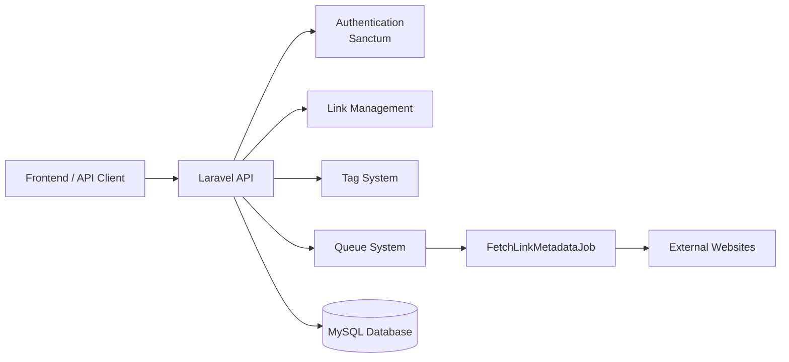
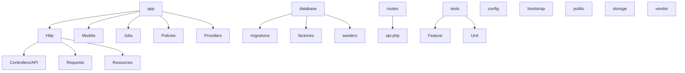
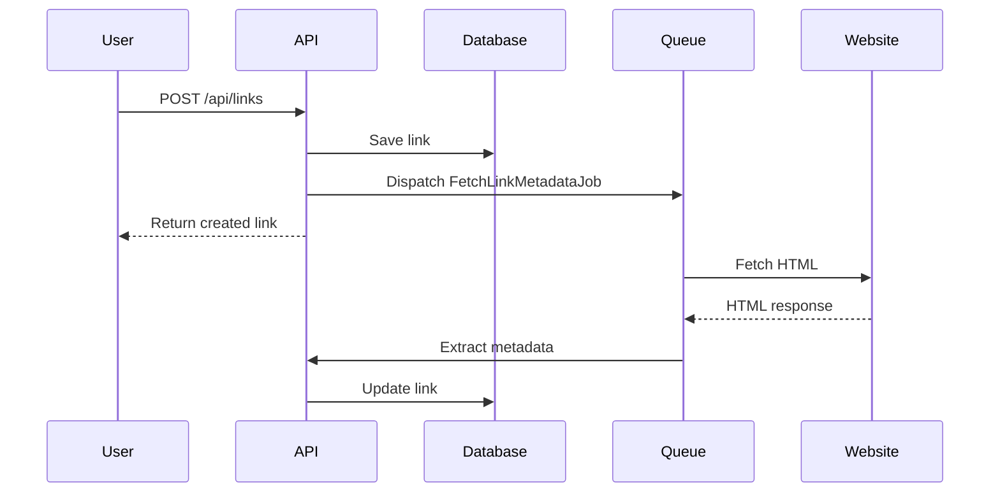

# LinksApp API

A RESTful API built with **Laravel** that helps users save, organize, and rediscover useful links using tags, search, filters, and automatic metadata extraction.

LinksApp is designed as a lightweight bookmarking system for developers, students, and knowledge workers who frequently collect useful online resources.

---

# Overview

LinksApp is a link management application that allows users to:

- Save URLs quickly
- Organize links using tags
- Track reading progress
- Mark important links as favorites
- Retrieve links using search and filters
- Automatically fetch metadata from webpages

The system focuses on **fast capture, clean organization, and efficient retrieval of knowledge resources**.

---

# Goals

The main goals of LinksApp are:

- Enable users to **save links in seconds**
- Provide **clean organization using tags**
- Track link progress with **status indicators**
- Allow users to **quickly retrieve links** with search and filters
- Keep the system **simple, lightweight, and fast**

---

# Target Users

LinksApp is designed for people who regularly collect knowledge resources:

- Developers saving documentation and tutorials
- Students collecting study materials
- Researchers tracking references
- Content consumers saving articles, blogs, and videos

---

# Core Use Cases

### User Authentication

A user registers and logs into the application.

### Saving a Link

The user saves a URL with optional notes and tags.

### Managing a Link

The user can:

- update notes
- change reading status
- mark as favorite
- edit tags

### Discovering Saved Links

The user can search and filter links to retrieve saved resources.

### Organizing Links

Links are organized using tags and reading status.

### Removing Links

Users can delete links that are no longer needed.

---

# Key Features

- Authentication with Laravel Sanctum
- Save and manage links
- Tag-based organization
- Favorite links
- Status tracking (`saved`, `reading`, `done`)
- Search and filtering
- Background metadata extraction
- Automated testing
- CI pipeline with GitHub Actions

---

# Architecture Overview



### Architecture Notes

The backend follows Laravel’s layered architecture:

- **Controllers** → handle HTTP requests
- **Form Requests** → input validation
- **Policies** → authorization
- **Models** → database interaction
- **Resources** → API responses
- **Jobs** → background processing
- **Queues** → asynchronous tasks

---

# Project Structure



### Structure Notes

- **Controllers/API**: handle incoming API requests and delegate logic
- **Requests**: validate request data using Form Request classes
- **Resources**: shape consistent JSON responses
- **Models**: represent database entities and relationships
- **Jobs**: run background tasks such as metadata extraction
- **Policies**: enforce authorization and ownership rules
- **migrations**: define database schema
- **factories / seeders**: generate testing and demo data
- **routes/api.php**: defines all API endpoints
- **tests/Feature**: covers authentication, links, filters, and jobs
- **tests/Unit**: reserved for isolated business logic tests

---

# Database ERD

```mermaid
erDiagram

users {
bigint id
string name
string email
string password
timestamps
}

links {
bigint id
bigint user_id
string url
string title
text notes
string status
boolean is_favorite
timestamp last_opened_at
timestamps
}

tags {
bigint id
bigint user_id
string name
timestamps
}

link_tag {
bigint link_id
bigint tag_id
}

users ||--o{ links : owns
users ||--o{ tags : owns
links ||--o{ link_tag : contains
tags ||--o{ link_tag : used_in
```

### Relationship Summary

- A **User** owns many links
- A **User** creates many tags
- A **Link** can have multiple tags
- A **Tag** can belong to multiple links

---

# API Flow Example

Saving a link triggers metadata extraction automatically.



---

# Features (MVP)

## Authentication

Authentication is handled using **Laravel Sanctum**.

Users can:

- Register with email + password
- Login and receive an API token
- Access protected endpoints using Bearer tokens
- Logout and invalidate tokens

### Endpoints

```
POST /api/register
POST /api/login
GET /api/me
POST /api/logout
```

---

# Link Management

Users can perform full CRUD operations on links.

### Create Link

Required field:

```
url
```

Optional fields:

```
title
notes
tags
status
is_favorite
```

Example request:

```json
{
  "url": "https://laravel.com/docs",
  "title": "Laravel Documentation",
  "notes": "Read about queues",
  "tags": ["laravel", "backend"]
}
```

---

### View Links

```
GET /api/links
```

Links are returned in **paginated format**.

---

### View Link

```
GET /api/links/{id}
```

---

### Update Link

```
PATCH /api/links/{id}
```

---

### Delete Link

```
DELETE /api/links/{id}
```

---

# Tags

Tags provide flexible organization.

Properties:

- Tags are **user-specific**
- Tags are **created automatically when attaching them to a link**
- Links can have **multiple tags**

### Tag Endpoints

```
GET /api/tags
POST /api/links/{id}/tags
DELETE /api/links/{id}/tags/{tagId}
```

---

# Status & Favorite

Each link tracks reading progress.

### Status values

```
saved
reading
done
```

### Favorite flag

```
is_favorite = true | false
```

---

# Search & Filtering

Links support powerful filtering.

### Search

Search across:

```
url
title
notes
```

Example:

```
GET /api/links?search=laravel
```

### Filtering

```
GET /api/links?tag=backend
GET /api/links?status=reading
GET /api/links?favorite=true
```

Filters can be combined.

```
GET /api/links?tag=laravel&status=saved
```

---

# Background Metadata Fetching

When a link is created, a background job automatically fetches metadata from the webpage.

Extracted information:

- page title
- meta description
- OpenGraph image
- site name
- favicon

This runs asynchronously using **Laravel Queues**.

Benefits:

- faster API responses
- enriched link previews
- improved user experience

---

# Security

Security measures implemented:

- Authentication using **Laravel Sanctum**
- Authorization using **Policies**
- Request validation using **Form Requests**
- User data isolation (users only access their own data)

---

# Testing

The project includes automated tests covering:

- authentication
- link creation
- link listing and filtering
- metadata fetching job

Testing tools used:

```
PHPUnit
Laravel testing utilities
HTTP client mocking
```

Run tests:

```bash
php artisan test
```

---

# Project Setup

### Clone repository

```bash
git clone https://github.com/YOUR_USERNAME/linksapp-api.git
cd backend
```

### Install dependencies

```bash
composer install
```

### Environment setup

```bash
cp .env.example .env
php artisan key:generate
```

### Configure database

```
DB_CONNECTION=mysql
DB_DATABASE=linksapp
DB_USERNAME=root
DB_PASSWORD=
```

### Run migrations

```bash
php artisan migrate
```

### Start server

```bash
php artisan serve
```

### Start queue worker

```bash
php artisan queue:work
```

---

# Future Roadmap

Planned improvements:

- Browser extension
- Link collections / folders
- Reminder system
- Public link sharing
- Import/export bookmarks
- Full-text search
- Mobile application

---

# Author

Soha
Backend Developer
